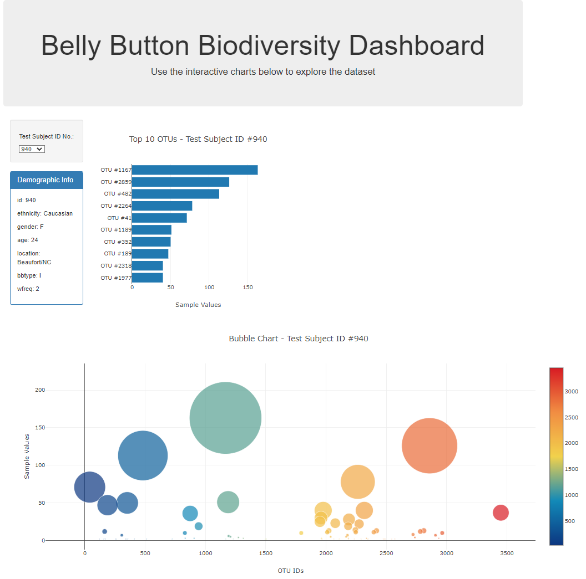

# belly-button-challenge
Module 14 Challenge (D3 JavaScript Interactive Web Visualisation) - Wassim Deen

# My GitHub Page
View the Deployed Interactive Board here: https://wdeen.github.io/

# Scenario Description
For this, I had to build an interactive dashboard to explore the Belly Button Biodiversity dataset, which catalogues the microbes that colonise human navels.

More info: https://robdunnlab.com/projects/belly-button-biodiversity/

The dataset reveals that a small handful of microbial species (also called operational taxonomic units, or OTUs, in the study) were present in more than 70% of people, while the rest were relatively rare.

# Summary of Challenge
- Part 1: Use the D3 library to read in `samples.json` from the URL:
    - `https://2u-data-curriculum-team.s3.amazonaws.com/dataviz-classroom/v1.1/14-Interactive-Web-Visualizations/02-Homework/samples.json`

- Part 2: Create a horizontal bar chart with a dropdown menu to display the top 10 OTUs found in that individual.
    - Use `sample_values` as the values for the bar chart.
    - Use `otu_ids` as the labels for the bar chart.
    - Use `otu_labels` as the hovertext for the chart.

<p align="center">
  
</p>

- Part 3: Create a bubble chart that displays each sample.
    - Use `otu_ids` for the x values.
    - Use `sample_values` for the y values.
    - Use `sample_values` for the marker size.
    - Use `otu_ids` for the marker colors.
    - Use `otu_labels` for the text values.

<p align="center">
  
</p>

- Part 4: Display the sample metadata, i.e., an individual's demographic information on the panel body.

- Part 5: Display each key-value pair from the metadata sample JSON object on the same panel body.

<p align="center">
  
</p>

- Part 6: Update all the plots when a new sample is selected from the dropdown menu.

# Final Interactive Board

<p align="center">
  
</p>

# Notes
1. All parts was completed in the JavaScript solution file (`app.js`).
2. Run the HTML file (`index.html`) on a modern web browser, like Google Chrome, to view the interactive board.
3. The JSON sample file (`samples.json`) is used only to preview the sample data extracted from the supplied URL in Part 1.

# Final Repository Structure
```
├── README.md
├── samples.json
├── index.html
├── Images
└── static
    └── js
        ├── app.js
        ├── .gitkeep

```
